# Urban Performance Club 💪

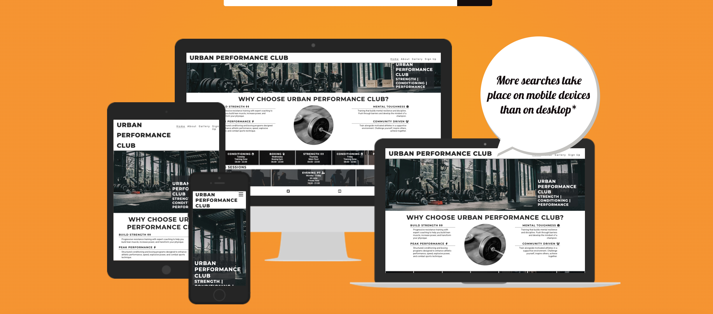

A comprehensive, responsive website for Urban Performance Club - a premium gym and performance training facility located in Birmingham’s Jewellery Quarter. Built with HTML5, CSS3, and Bootstrap 5, the site showcases strength training, conditioning programs, a dedicated boxing gym, and personalized coaching.

Live site: [Urban Performance Club](https://hassib-95.github.io/urban-performance-club/)

---

## Table of Contents

- [User Experience (UX)](#user-experience-ux)
- [Features](#features)
- [Technologies Used](#technologies-used)
- [Testing](#testing)
- [Deployment](#deployment)
- [Credits](#credits)

---

## User Experience (UX)

### Site Goals

The goal of Urban Performance Club website is to attract new members by showcasing the gym’s facilities, professional coaching staff, and comprehensive training programs. The site provides all essential information for potential members to make an informed decision and sign up online.

### User Stories

| ID  | User Story                                                                                                                                | Priority    | Status  |
| --- | ----------------------------------------------------------------------------------------------------------------------------------------- | ----------- | ------- |
| #1  | As a first-time visitor, I want to immediately understand what Urban Performance Club offers so I can decide if it meets my fitness needs | Must Have   | ✅ Done |
| #2  | As a first-time visitor, I want to see the benefits of joining so I can understand the value proposition                                  | Must Have   | ✅ Done |
| #3  | As a first-time visitor, I want to view photos of the gym facility so I can see the equipment and environment before visiting             | Must Have   | ✅ Done |
| #4  | As a first-time visitor, I want to learn about the coaches and their qualifications so I can trust their expertise                        | Should Have | ✅ Done |
| #5  | As a first-time visitor, I want to see the gym’s location and contact information so I can plan a visit or get in touch                   | Should Have | ✅ Done |
| #6  | As a first-time visitor, I want to read answers to common questions so I can get information quickly without calling                      | Could Have  | ✅ Done |
| #7  | As a first-time visitor, I want to read testimonials from current members so I can understand others’ experiences                         | Could Have  | ✅ Done |
| #8  | As a returning visitor, I want to check the weekly training schedule so I can plan which sessions to attend                               | Must Have   | ✅ Done |
| #9  | As a returning visitor, I want to see personal training availability so I can book 1-on-1 coaching sessions                               | Could Have  | ✅ Done |
| #10 | As a returning visitor, I want to see detailed opening hours so I can know when coaches are available vs facility access only             | Should Have | ✅ Done |
| #11 | As a returning visitor, I want to sign up for membership through an online form so I can join without needing to call or visit            | Must Have   | ✅ Done |
| #12 | As a returning visitor, I want to learn about the gym’s story and mission so I can connect with the club’s values                         | Should Have | ✅ Done |
| #13 | As a frequent user, I want to access the website on my mobile device so I can check schedules and information on the go                   | Must Have   | ✅ Done |
| #14 | As a frequent user, I want easy navigation between pages so I can find information quickly                                                | Must Have   | ✅ Done |
| #15 | As a frequent user, I want to connect with the gym on social media so I can stay updated with news and events                             | Could Have  | ✅ Done |
| #16 | As the site owner, I want to showcase our unique boxing gym offering so we differentiate from standard gyms                               | Should Have | ✅ Done |
| #17 | As the site owner, I want to collect member information through the signup form so we can contact potential members                       | Must Have   | ✅ Done |
| #18 | As the site owner, I want to present a professional, trustworthy image so potential members feel confident joining                        | Must Have   | ✅ Done |

### Wireframes

Home Screen

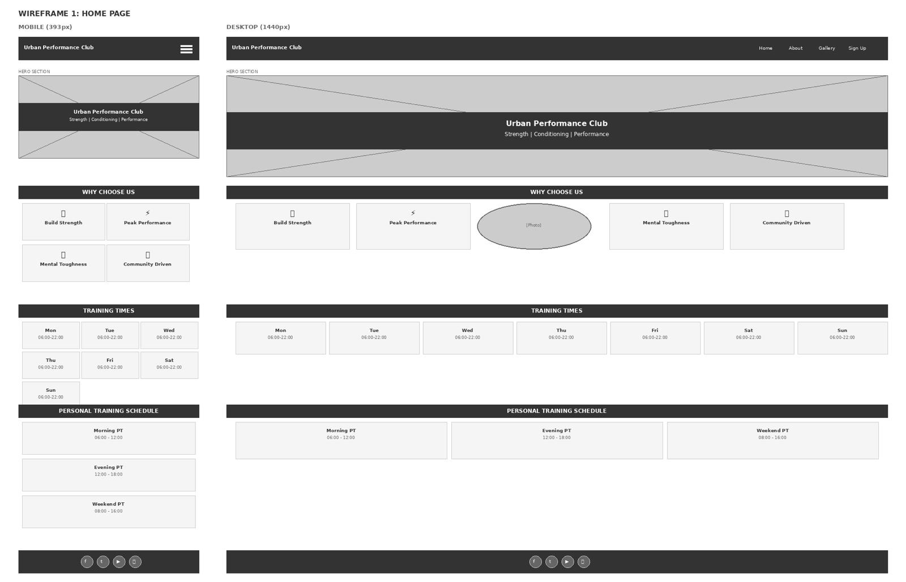

About Page

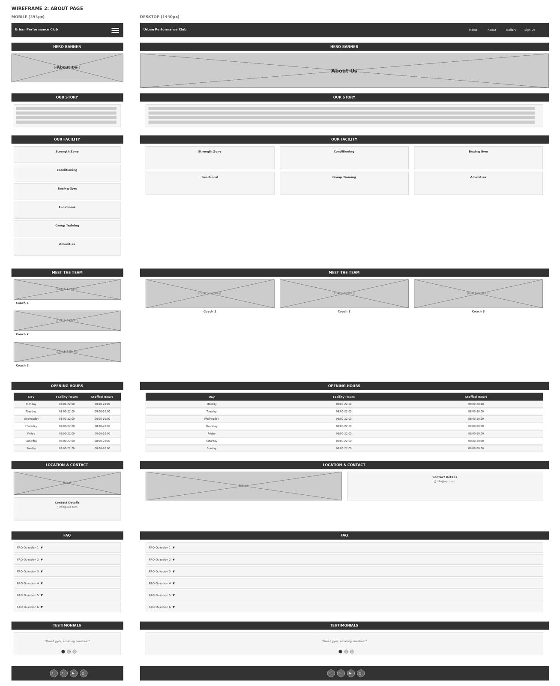

Gallery Page

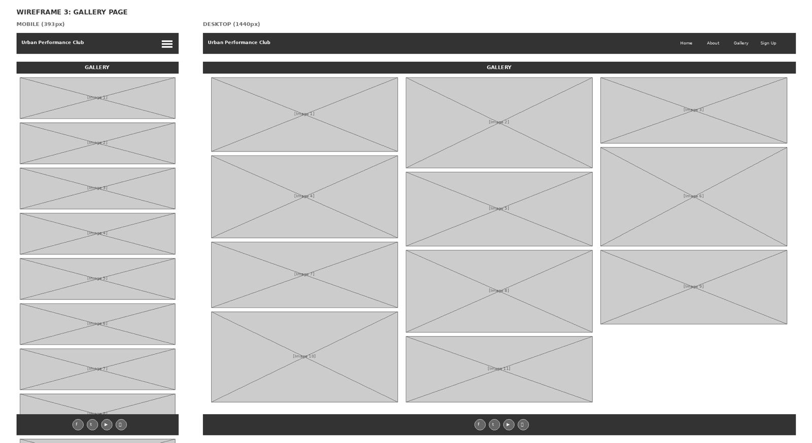

Sign Up Page

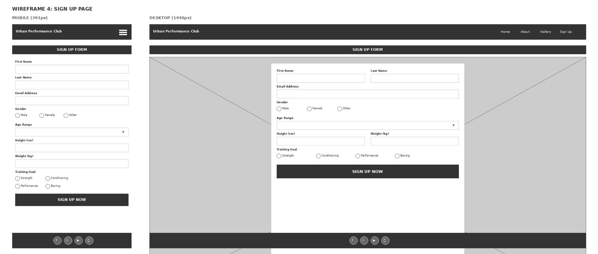

### Design

_Colour Scheme_

| Colour       | Hex                   | Usage                  |
| ------------ | --------------------- | ---------------------- |
| Dark Gray    | #252525               | Headings               |
| Medium Gray  | #3a3a3a               | Body text              |
| White        | #ffffff               | Background             |
| Dark Overlay | rgba(33, 37, 41, 0.8) | Hero and form overlays |
| Light Gray   | #f8f9fa               | Section backgrounds    |

The color palette conveys professionalism, strength, and clarity while maintaining WCAG AA accessibility standards for text contrast.

_Typography_

- _Montserrat_ — Used for headings. A bold, geometric sans-serif that conveys strength and modernity. Weights: 300, 400, 600, 700, 800.
- _Roboto_ — Used for body text. A clean, highly readable sans-serif optimized for web display. Weights: 300, 400, 500, 700.

Both fonts are imported from Google Fonts.

_Design Rationale_

The design choices were made to reflect the professional, performance-focused brand identity of Urban Performance Club:

- _Dark color palette_: Chosen to convey strength, seriousness, and professionalism. The dark grays create a masculine, athletic aesthetic appropriate for a performance gym.
- _Montserrat font for headings_: Selected for its bold, geometric letterforms that communicate strength and confidence. The uppercase styling adds impact and reinforces the professional brand image.
- _Roboto for body text_: Chosen for its excellent readability at all sizes and its modern, clean appearance that complements Montserrat without competing for attention.
- _Semi-transparent overlays_: Used on hero and form sections to ensure text readability over background images while maintaining visual interest.
- _Flexbox layouts_: Implemented throughout for flexible, responsive designs that adapt smoothly to all screen sizes without complex calculations.
- _Bootstrap integration_: Used selectively for complex interactive components (carousel, accordion, forms) while maintaining custom styling for brand consistency.
- _Boxing gym specialization_: Integrated throughout the site (story, facility, team, signup) to differentiate from standard gyms and attract a specific target audience.

---

## Features

### Existing Features

_Fixed Navigation Bar_

- Stays visible during scrolling for easy access
- Collapses to hamburger menu on mobile (< 768px)
- Horizontal menu on tablets and desktop
- Active page indicator shows current location
- Smooth hover effects on desktop

_Home Page — Hero Section_

- Full-width background image showcasing gym environment
- Semi-transparent overlay with club name and core values
- “Strength | Conditioning | Performance” tagline
- Responsive positioning (bottom-left mobile, bottom-right desktop)

_Home Page — Why Choose Us_

- Four key benefits with Font Awesome icons:
  - Build Strength (progressive resistance training)
  - Peak Performance (athletic conditioning)
  - Mental Toughness (resilience training)
  - Community Driven (supportive environment)
- Circular feature image for visual interest
- Responsive layout: stacked → left/right → horizontal

_Home Page — Training Times_

- Seven-day schedule with daily focus areas
- 06:00 - 22:00 opening hours
- Boxing gym highlighted on Wednesday
- Flexbox grid adapts to all screen sizes
- Background image with dark overlay

_Home Page — Personal Training Schedule_

- Morning, evening, and weekend PT availability
- Session durations clearly displayed (60-90 minutes)
- Consistent styling with training times section

_About Page — Hero Section_

- Full-width banner with “About Us” heading
- “Elevate Your Performance. Transform Your Life.” tagline
- Sets professional tone for detailed content

_About Page — Our Story_

- Compelling narrative about club founding in 2018
- Highlights boxing gym as unique feature
- Emphasizes community and professional coaching
- Builds emotional connection with potential members

_About Page — Our Facility_ (Bootstrap Cards)

- Six training zones showcased:
  - Strength Zone (Olympic platforms, power racks)
  - Conditioning Area (assault bikes, rowing machines)
  - _Boxing Gym_ (professional ring, bags, equipment)
  - Functional Training (turf area, sleds, plyometrics)
  - Group Training Space (small group sessions)
  - Private Training Rooms (1-on-1 coaching)
  - Amenities (locker rooms, showers, lounge)
- Font Awesome icons for visual clarity
- Responsive 3-column grid (1-2-3 columns)

_About Page — Meet the Team_ (Bootstrap Cards with Images)

- Three coach profiles:
  - Marcus Chen (Head Coach & Owner)
  - Sarah Mitchell (Conditioning Coach)
  - James Rodriguez (_Boxing Coach_ & Personal Trainer)
- Professional photos build trust
- Expertise and certifications highlighted

_About Page — Opening Hours_ (Bootstrap Table)

- Detailed daily schedule showing:
  - Facility hours (member access)
  - Staffed hours (coach availability)
- Weekend hours reflect realistic operations
- Alert box explains 24/7 key card access and boxing supervision
- Responsive table scrolls on mobile

_About Page — Location & Contact_

- Two-column card layout:
  - Find Us: Birmingham Jewellery Quarter address, parking, transport
  - Contact Details: Phone (clickable tel:), email (clickable mailto:), response time
- Call-to-action button to signup page
- Google Maps embed showing exact location
- Responsive iframe with proper aspect ratio

_About Page — FAQ Section_ (Bootstrap Accordion - Interactive)

- Six common questions with collapsible answers:
  - Do I need experience to join?
  - What membership options do you offer?
  - Can I try a class before joining?
  - What should I bring to my first session?
  - Do you offer nutrition advice?
  - How does the boxing gym work?
- First question starts expanded
- Smooth expand/collapse animations
- Addresses common concerns proactively

_About Page — Testimonials_ (Bootstrap Carousel - Interactive)

- Three member success stories:
  - Emma Thompson (beginner transformation)
  - David Kumar (athlete performance with boxing focus)
  - Sarah O’Brien (24/7 access and personal training)
- Auto-rotating carousel with manual controls
- Quote icons for visual interest
- Navigation arrows and indicators
- Builds social proof and credibility

_Gallery Page_

- 11 responsive images showing:
  - Gym equipment and facility
  - Training sessions in action
  - Boxing gym
  - Community atmosphere
- CSS multi-column layout (1-2-3 columns)
- Masonry-style arrangement
- Proper alt text for accessibility

_Sign Up Page_ (Enhanced Form)

- Bootstrap 5 form with extended fields:
  - Name (first and last, side-by-side on desktop)
  - Email (validated format)
  - Gender (radio buttons: Male, Female, Other)
  - Age Range (dropdown: 18-24, 25-34, 35-44, 45-54, 55-64, 65+)
  - Height (number input in cm, 100-250 range)
  - Weight (number input in kg, 30-200 range)
  - Training Goal (radio: Strength, Conditioning, Performance, _Boxing_)
- Full-screen background image
- Semi-transparent dark container with white text
- HTML5 validation on all fields
- _EmailJS integration_ - form submissions sent directly to gym email
- Success message confirmation after submission
- Form automatically resets after successful submission
- Responsive: full-width mobile, centered card desktop

_Footer_

- Social media links with Font Awesome icons (Facebook, Twitter, YouTube, Instagram)
- Links open in new tabs with rel="noopener" security
- Comprehensive aria-label attributes for screen readers
- Flexbox layout ensures even spacing
- Consistent across all pages

### Features Left to Implement

- Member portal with workout logging and progress tracking
- Video tutorial library for exercise techniques
- Blog section with training and nutrition articles
- Payment processing for online membership sign-up

---

## Technologies Used

### Languages

- HTML5
- CSS3
- JavaScript (via Bootstrap for interactive components)

### Frameworks and Libraries

- [Bootstrap 5.3.0](https://getbootstrap.com/) — Grid system, forms, cards, accordion, carousel, tables
- [Google Fonts](https://fonts.google.com/) — Montserrat and Roboto typography
- [Font Awesome 6.x](https://fontawesome.com/) — Icons throughout the site
- [EmailJS](https://www.emailjs.com/) — Email integration for signup form submissions

### Tools

- [VS Code](https://code.visualstudio.com/) — Code editor
- [Git](https://git-scm.com/) — Version control
- [GitHub](https://github.com/) — Code repository and deployment via GitHub Pages
- [Chrome DevTools](https://developer.chrome.com/docs/devtools/) — Responsive testing and debugging
- [TinyPNG](https://tinypng.com/) — Image compression
- [Squoosh](https://squoosh.app/) — Image optimization and WebP conversion
- [Balsamiq](https://balsamiq.com/) / [Figma](https://figma.com/) — Wireframe creation
- [Am I Responsive](https://ui.dev/amiresponsive) — Mockup generator

---

## Testing

### Manual Testing

| Feature                       | Expected                                      | Result            | Pass/Fail |
| ----------------------------- | --------------------------------------------- | ----------------- | --------- |
| Logo link                     | Returns to home page from any page            | Works as expected | ✅ Pass   |
| Home nav link                 | Navigates to home page, shows active state    | Works as expected | ✅ Pass   |
| About nav link                | Navigates to about page, shows active state   | Works as expected | ✅ Pass   |
| Gallery nav link              | Navigates to gallery page, shows active state | Works as expected | ✅ Pass   |
| Sign Up nav link              | Navigates to signup page, shows active state  | Works as expected | ✅ Pass   |
| Hamburger menu                | Opens/closes on mobile, shows all links       | Works as expected | ✅ Pass   |
| Nav hover effects             | Underline appears on hover (desktop)          | Works as expected | ✅ Pass   |
| FAQ accordion                 | Questions expand/collapse smoothly            | Works as expected | ✅ Pass   |
| Testimonials carousel         | Auto-rotates every 5 seconds                  | Works as expected | ✅ Pass   |
| Carousel next arrow           | Advances to next testimonial                  | Works as expected | ✅ Pass   |
| Carousel previous arrow       | Returns to previous testimonial               | Works as expected | ✅ Pass   |
| Carousel indicators           | Jumps to specific testimonial                 | Works as expected | ✅ Pass   |
| Google Maps                   | Zoom and pan work correctly                   | Works as expected | ✅ Pass   |
| Phone link                    | Opens phone dialer on mobile                  | Works as expected | ✅ Pass   |
| Email link                    | Opens default email client                    | Works as expected | ✅ Pass   |
| Sign Up CTA button            | Navigates to signup page from About           | Works as expected | ✅ Pass   |
| Form - first name required    | Shows validation error if empty               | Works as expected | ✅ Pass   |
| Form - last name required     | Shows validation error if empty               | Works as expected | ✅ Pass   |
| Form - email required         | Shows validation error if empty               | Works as expected | ✅ Pass   |
| Form - email format           | Shows validation error if invalid format      | Works as expected | ✅ Pass   |
| Form - gender required        | Shows validation error if not selected        | Works as expected | ✅ Pass   |
| Form - age required           | Shows validation error if not selected        | Works as expected | ✅ Pass   |
| Form - height required        | Shows validation error if empty               | Works as expected | ✅ Pass   |
| Form - height range           | Shows validation error if outside 100-250     | Works as expected | ✅ Pass   |
| Form - weight required        | Shows validation error if empty               | Works as expected | ✅ Pass   |
| Form - weight range           | Shows validation error if outside 30-200      | Works as expected | ✅ Pass   |
| Form - training goal required | Shows validation error if not selected        | Works as expected | ✅ Pass   |
| Form - valid submission       | Submits to Code Institute form dump           | Works as expected | ✅ Pass   |
| Social media - Facebook       | Opens Facebook in new tab                     | Works as expected | ✅ Pass   |
| Social media - Twitter        | Opens Twitter in new tab                      | Works as expected | ✅ Pass   |
| Social media - YouTube        | Opens YouTube in new tab                      | Works as expected | ✅ Pass   |
| Social media - Instagram      | Opens Instagram in new tab                    | Works as expected | ✅ Pass   |
| Responsive - mobile           | Layout stacks, hamburger menu visible         | Works as expected | ✅ Pass   |
| Responsive - tablet           | Multi-column layouts, horizontal nav          | Works as expected | ✅ Pass   |
| Responsive - desktop          | Full responsive layouts, hover effects        | Works as expected | ✅ Pass   |

### Validator Testing

All code was validated using industry standard tools to ensure it meets best practice standards.

_HTML Validation_

All four HTML pages were validated using the W3C HTML Validator. No errors were found.

index.html

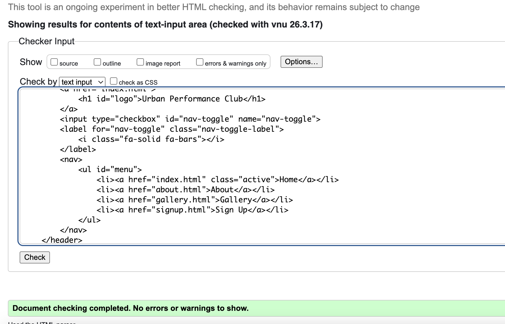

about.html

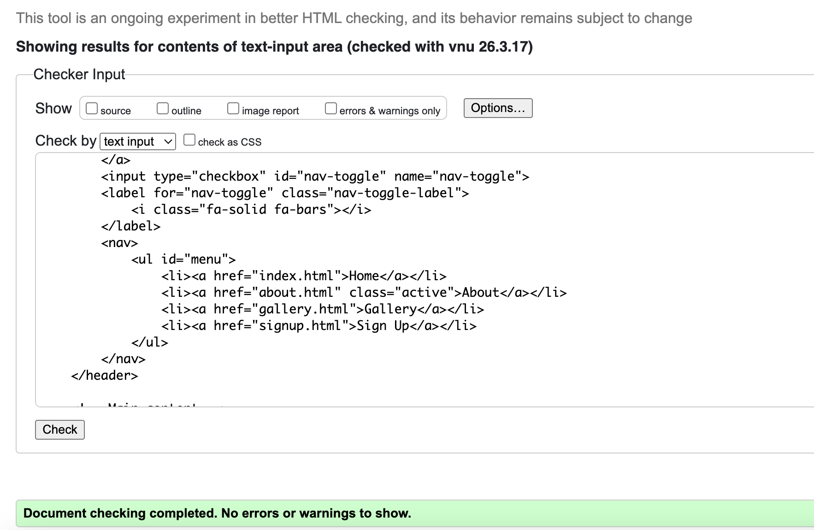

gallery.html

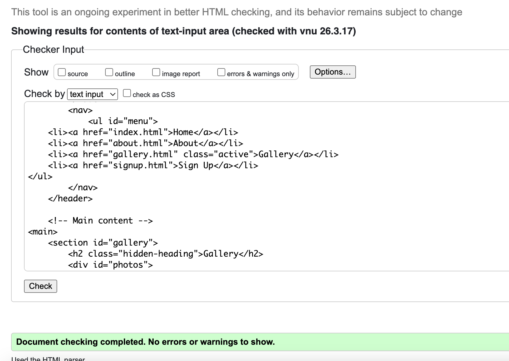

signup.html

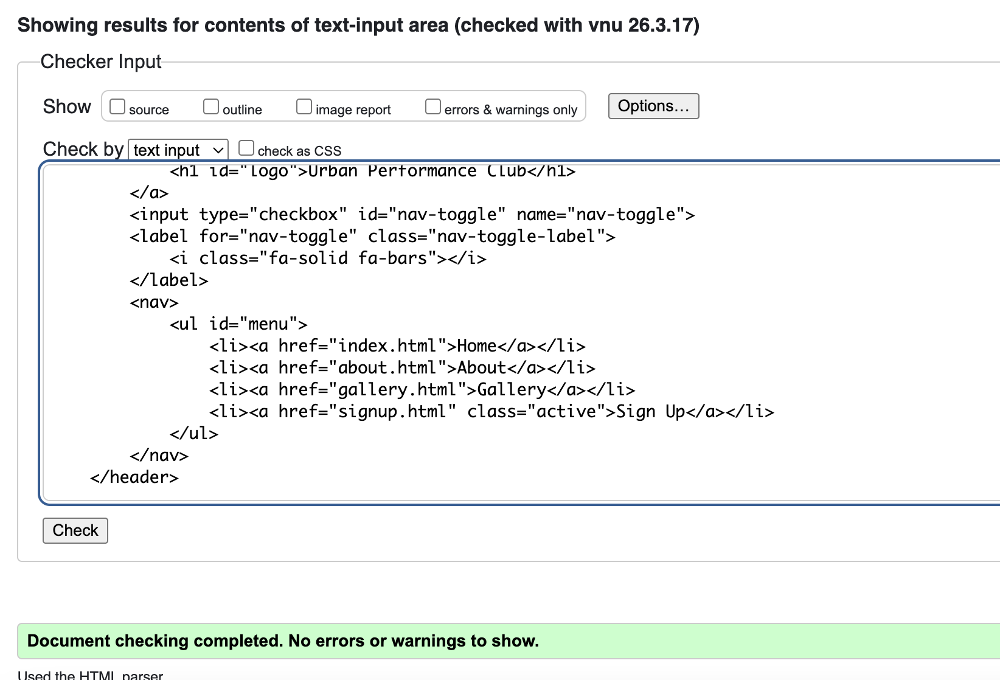

_CSS Validation_

The CSS was validated using the W3C CSS Validator. No errors were found.

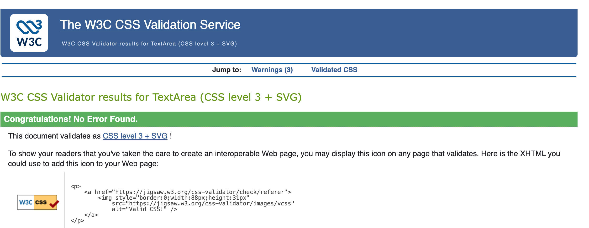

*JavaScript Validation*

The JavaScript was validated using JSHint. No errors or warnings were found. The code uses ES6 syntax (const, let) and the EmailJS global library.

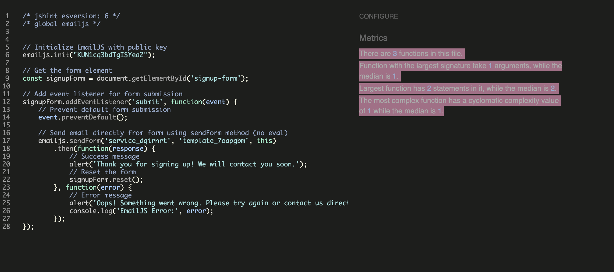

### Agile Methodology

This project was planned and managed using GitHub Projects with a Kanban board. User stories were written in the format “As a [user type], I want [goal] so that [reason]” with clear acceptance criteria and task breakdowns. Stories were prioritised using MoSCoW labels — Must Have (9 stories), Should Have (5 stories), and Could Have (4 stories). All 18 user stories were completed and implemented successfully.

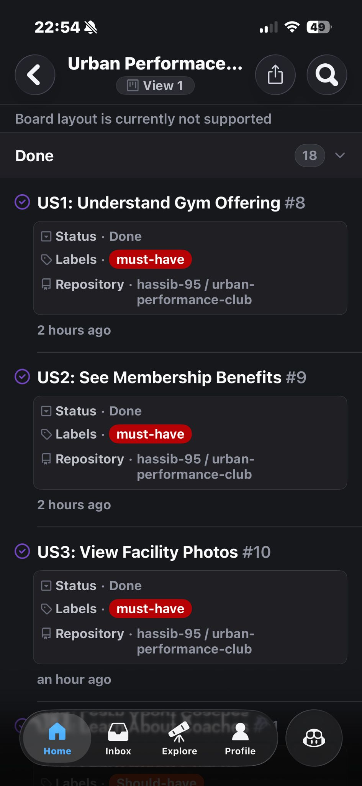
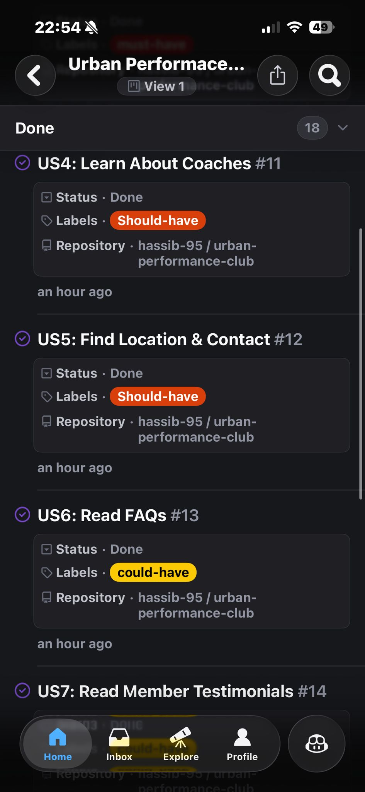
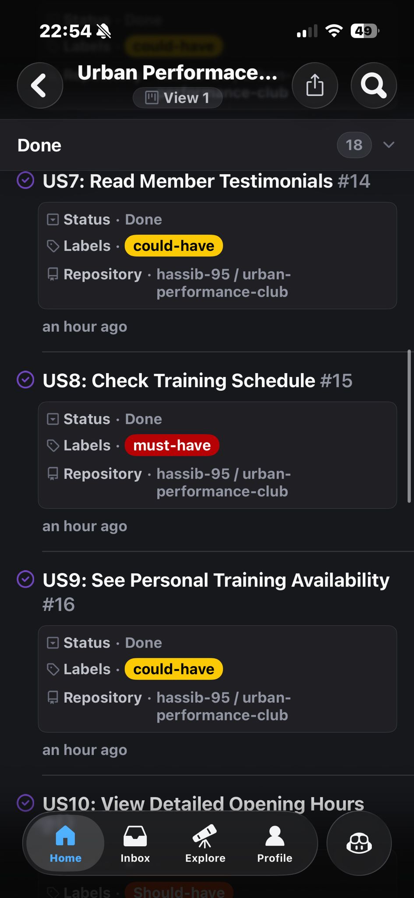
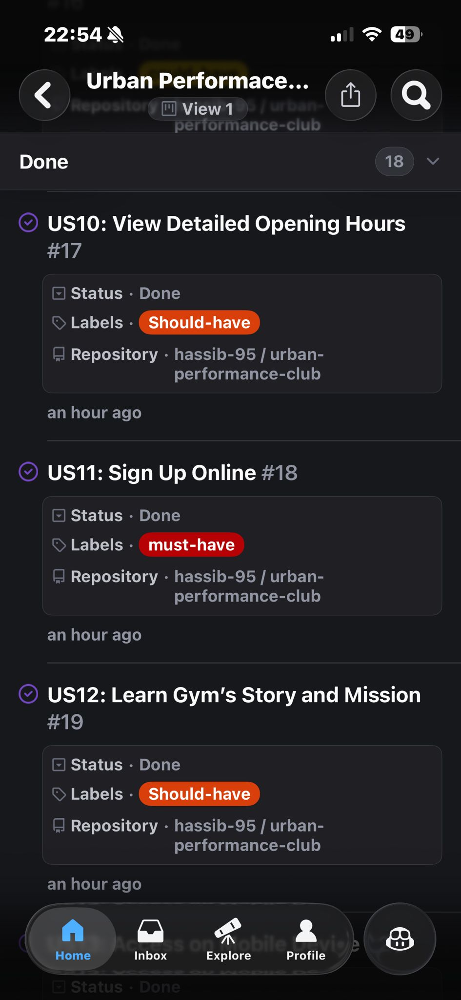
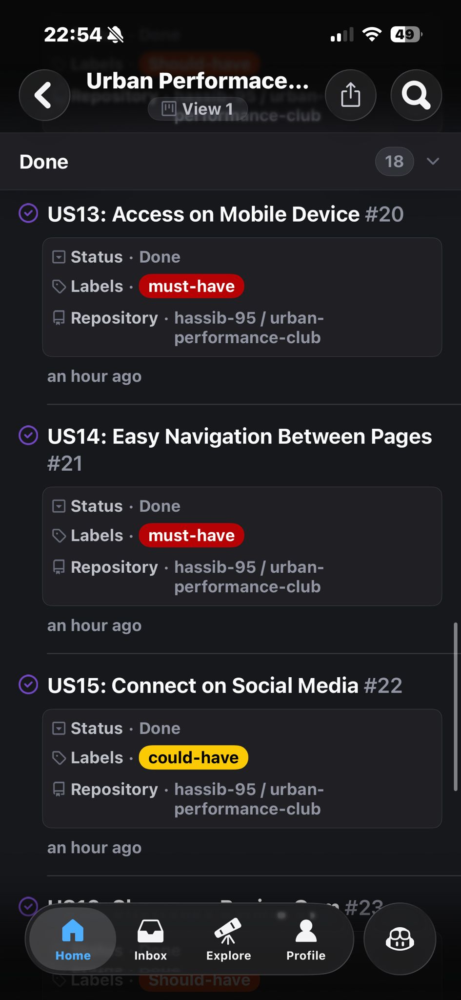
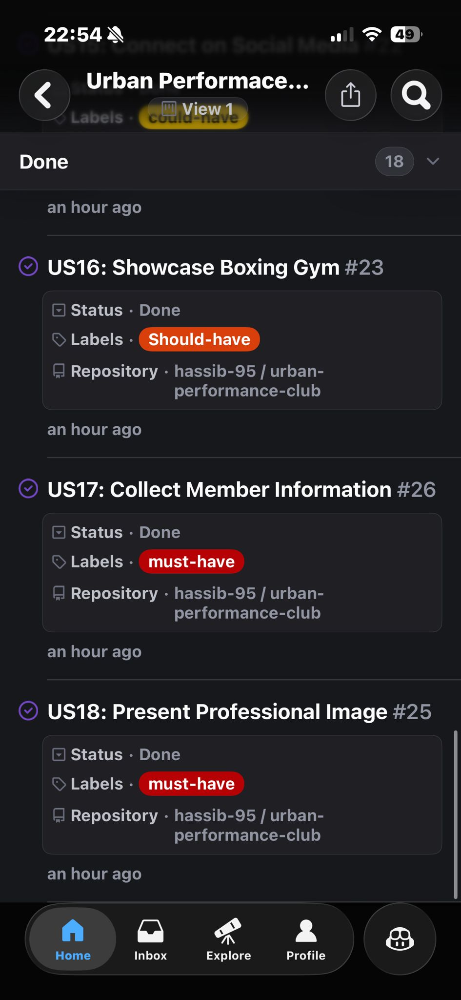

### Browser Testing

| Browser      | Result               |
| ------------ | -------------------- |
| Chrome 120+  | ✅ Works as expected |
| Firefox 121+ | ✅ Works as expected |
| Safari 17+   | ✅ Works as expected |
| Edge 120+    | ✅ Works as expected |

### Device Testing

| Device                        | Result               |
| ----------------------------- | -------------------- |
| MacBook Pro (Desktop)         | ✅ Works as expected |
| iPhone 12/13/14               | ✅ Works as expected |
| iPad Air/Pro                  | ✅ Works as expected |
| Samsung Galaxy S21/S22        | ✅ Works as expected |
| Chrome DevTools (all devices) | ✅ Works as expected |

### Known Bugs

No known bugs at time of submission.

---

## Development Lifecycle

### Planning Phase

The project began with research into existing gym websites to understand user expectations and industry standards. User stories were written to capture the needs of different visitor types (first-time, returning, frequent users, and site owners). Wireframes were created for all four pages (home, about, gallery, signup) showing mobile and desktop layouts.

### Development Approach

The project was built using a _systematic, commit-by-commit approach_ inspired by the Code Institute Love Running walkthrough. This methodology ensured:

- Each commit represented a single, well-defined feature or fix
- Commit messages clearly described what was added or changed
- Features were built incrementally from mobile-first to desktop
- Clear version control made it easy to track progress and revert if needed

_Example commit progression:_

1. “Add hero section with cover text and tagline”
1. “Add reasons section”
1. “Add circular image to reasons section”
1. “Make reasons section responsive”

### Mobile-First Development

All pages were built mobile-first, starting with base styles for small screens (< 576px) then progressively enhanced with media queries at 576px, 768px, 992px, and 1200px breakpoints. This approach ensured optimal mobile performance and allowed features to be added incrementally without breaking existing layouts.

### Bootstrap Integration

Bootstrap 5 was integrated selectively for complex interactive components (carousel, accordion, forms, tables) on the About and Sign Up pages only. This balanced the benefits of a professional framework with maintaining custom styling and avoiding unnecessary bloat on simple pages.

### Iterative Refinement

Throughout development, features were tested across multiple devices and browsers. Issues were identified and resolved systematically:

- Image file sizes optimized (initially 5MB+, compressed to < 500KB)
- Bootstrap conflicts resolved through specific CSS selectors
- Heading hierarchy corrected for accessibility compliance
- Responsive layouts refined for consistent appearance

### Total Development Time

The project was completed over approximately 4-6 weeks with 43+ structured commits demonstrating systematic development workflow.

---

## Reflection & Future Improvements

### What I Learned

_Technical Skills:_

- Advanced CSS layouts using Flexbox for responsive designs
- Bootstrap 5 integration for interactive components while maintaining custom branding
- Mobile-first responsive design methodology with strategic breakpoints
- Image optimization techniques for web performance
- Git workflow with clear, descriptive commits
- Accessibility standards (WCAG compliance, semantic HTML, ARIA labels)
- Form validation using HTML5 and Bootstrap

_Soft Skills:_

- Breaking large projects into manageable, logical commits
- Problem-solving through debugging layout issues and Git conflicts
- Attention to detail for pixel-perfect implementation
- Time management balancing feature development with testing

### Challenges Overcome

1. _Image File Size Management_: Initially pushed images that were too large (5-6MB), causing Git failures. Learned to optimize all images to under 500KB using TinyPNG and Squoosh, and to batch-commit large files.
1. _Bootstrap CSS Conflicts_: Adding Bootstrap to the signup page caused inconsistent logo styling across pages. Resolved by limiting Bootstrap to necessary pages only and using specific CSS selectors to override defaults.
1. _Heading Hierarchy for Accessibility_: Validator identified improper heading structure (multiple h1 tags, skipping from h2 to h4). Fixed by ensuring only one h1 per page and converting decorative headings to styled paragraphs.

### What Could Be Improved

If revisiting this project, I would:

1. _Add wireframes earlier in planning_: While wireframes were created, doing them before any coding would have prevented some layout revisions during development.
1. _Implement a CSS preprocessor_: Using SASS/SCSS would have made managing the stylesheet easier with variables, nesting, and mixins for repeated patterns.
1. _Create a design system document_: A separate document defining all colors, typography, spacing, and component patterns would ensure even more consistency.
1. _Add automated testing_: While manual testing was thorough, implementing automated tests for form validation and interactive components would catch regressions faster.
1. _Progressive enhancement for JavaScript_: Although Bootstrap JS is required for carousel/accordion, considering vanilla JS alternatives or graceful degradation would improve accessibility.

### Future Enhancements

_Phase 1 (Next 3 months):_

- Implement online class booking system with calendar
- Add member login and basic dashboard
- Create blog section for training tips and gym news

_Phase 2 (6-12 months):_

- Develop member portal with workout logging and progress tracking
- Integrate payment processing for online membership sign-up
- Add video tutorial library for exercise techniques

_Phase 3 (12+ months):_

- Build mobile app for on-the-go access
- Integrate with fitness tracking apps (Strava, MyFitnessPal)
- Implement AI-powered personalized training recommendations

---

## Deployment

The site was deployed to GitHub Pages using the following steps:

1. Go to the repository on GitHub: [urban-performance-club](https://github.com/hassib-95/urban-performance-club/)
1. Click _Settings_
1. Click _Pages_ in the left sidebar
1. Under _Source_ select _Deploy from a branch_
1. Select _main_ branch and _/ (root)_ folder
1. Click _Save_
1. The live site URL will appear at the top of the Pages section (may take 2-3 minutes)

Live site: <https://hassib-95.github.io/urban-performance-club/>

### Forking the Repository

1. Go to the repository on GitHub
1. Click the _Fork_ button in the top right corner
1. A copy of the repository will be created in your GitHub account

### Cloning the Repository

1. Go to the repository on GitHub
1. Click the _Code_ button
1. Copy the HTTPS URL
1. Open your terminal and run git clone <url>

---

## Credits

### Content

- All text content for Urban Performance Club is original, written by Hassib Choudry
- Training programs, facility descriptions, and coach biographies are tailored to a fictional but realistic gym
- FAQ answers address real-world gym membership questions
- Testimonials are fictional success stories representative of typical gym member experiences

### Media

_Stock Photography:_

All images sourced from royalty-free stock photography websites:

- **[Pexels](https://www.pexels.com/)** — Hero images, training backgrounds, gallery photos
- **[Unsplash](https://unsplash.com/)** — Coach photos, facility shots, boxing gym images

All images were optimized using [TinyPNG](https://tinypng.com/) and [Squoosh](https://squoosh.app/) to ensure fast page loading.

_Icons:_

- All icons provided by [Font Awesome 6.x](https://fontawesome.com/) under their free license

_Fonts:_

- _Montserrat_ and _Roboto_ provided by [Google Fonts](https://fonts.google.com/) under the Open Font License

### Code

_Love Running Walkthrough Project_ (Code Institute)

The foundational structure and responsive design patterns were learned from the Love Running walkthrough project. Key concepts adapted:

- Mobile-first responsive design methodology
- Fixed navigation header with CSS-only hamburger menu
- Flexbox layouts for header, footer, and content sections
- CSS multi-column gallery layout
- Hero section with overlay text
- Form structure and HTML5 validation
- Media query strategy and breakpoint selection

_Significant Enhancements Beyond Love Running:_

- Complete About page with 7 comprehensive sections
- Bootstrap 5 integration (accordion, carousel, cards, tables, form components)
- Interactive JavaScript components via Bootstrap
- Enhanced form with demographic fields
- Google Maps embed integration
- Professional content strategy (significantly more detailed)
- Boxing gym specialization throughout

_Bootstrap 5 Documentation:_

- [Forms](https://getbootstrap.com/docs/5.3/forms/overview/) — Form components and validation
- [Cards](https://getbootstrap.com/docs/5.3/components/card/) — Coach profiles and facility cards
- [Accordion](https://getbootstrap.com/docs/5.3/components/accordion/) — FAQ section
- [Carousel](https://getbootstrap.com/docs/5.3/components/carousel/) — Testimonials slideshow
- [Tables](https://getbootstrap.com/docs/5.3/content/tables/) — Opening hours schedule

_Additional Resources:_

- [CSS-Tricks](https://css-tricks.com/) — Flexbox and CSS multi-column layouts
- [MDN Web Docs](https://developer.mozilla.org/) — HTML5, CSS3, and web standards reference

### Acknowledgements

- Code Institute for the course material, Love Running walkthrough, and project brief
- My mentor for guidance on best practices and code reviews
- Code Institute Slack community for peer support and troubleshooting
- My assessor for their time reviewing this project and providing constructive feedback

---

Developed by Hassib Choudry as part of the Code Institute Level 5 Diploma in Web Application Development — Portfolio Project 1 (User Centric Frontend Development)

README last updated: February 2026
